# PicShack.com

Live website [here](https://p5-pic-shack.herokuapp.com/).
 

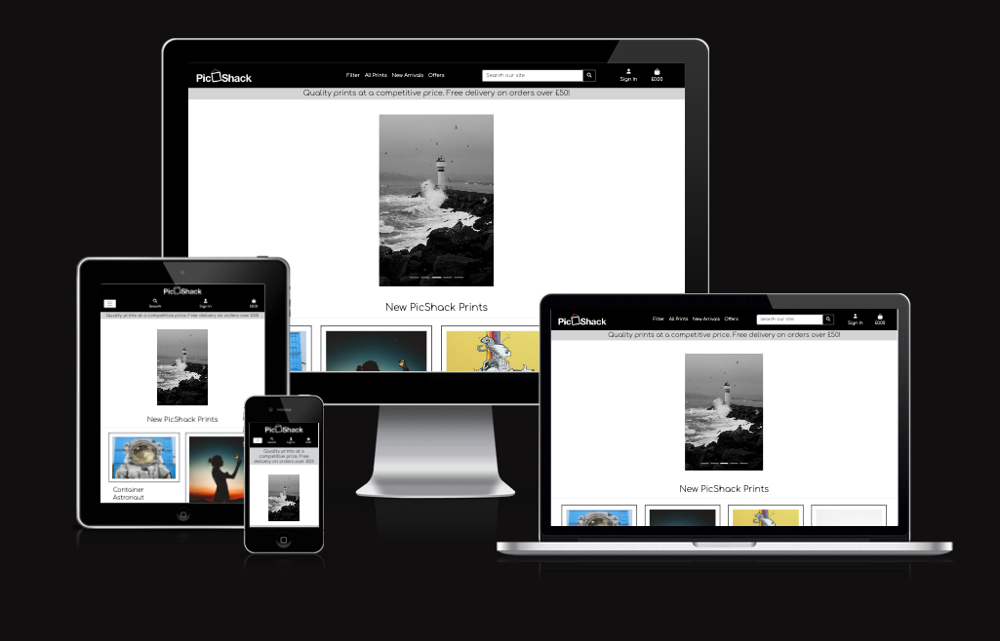

# Introduction

Welcome to my final Code Institute Project 5. This a full e-commerce application website with the purpose of selling pictures. 

It allows users to navigate freely, view products and make purchases without the need to create an account. The website incorporates full CRUD functionality. Another main feature of the website is the ability to have a superuser managing the content of the website and removing other user's content if need be. This also incoporates full CRUD functionlity.

Thye prodject has been developed using Django 3.2 framework.

## <a name="top">Table of Contents</a>

### [1. User Experience](#user-ex) 

- Design Approach
- User Expectations
	- New Users
	- Returning Users
	- Frequent Users
- Color Design
### [2. Features](#features)
- Landing Page:
	- Picture banner zoom effect
	- Navigation Bar
	- Category Cards:
		- EV News
		- Ask The Community
		- For Sale
		- Technical Area
	- Recent Post View
- Category Section:
	- Adding a Post button
	- View all Posts from that category
- Footer
- CRUD Functionality
- Authentication
- Input Validation
- Custom 404 Not Found Page

### [3. Wireframe](#wireframe)

The purpose of the wireframe is to try and visualise what the application will look like in webpage and mobile format. This is for guidance only.

Landing Page Mobile: 
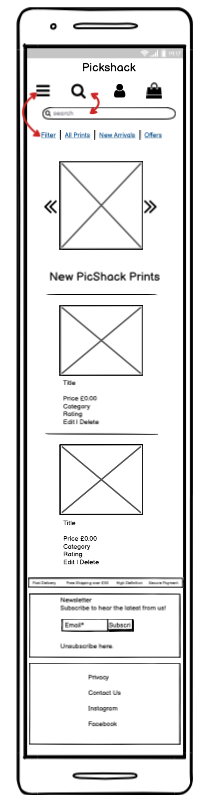
  

Sign In Page Mobile: 
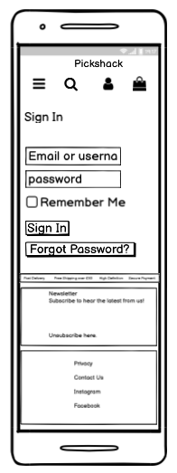
  

Signup Page Mobile: 
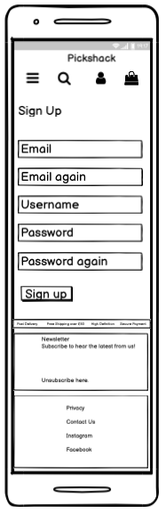
  

Products Page Mobile: 
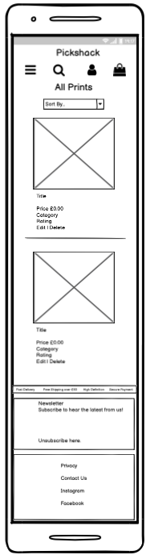
  

Product Detail Page Mobile: 
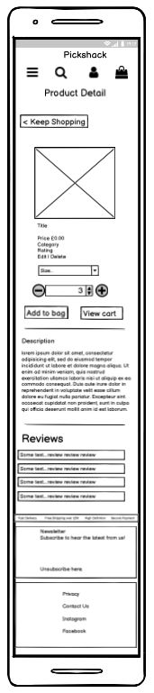
  

Shopping Bag Page Mobile: 
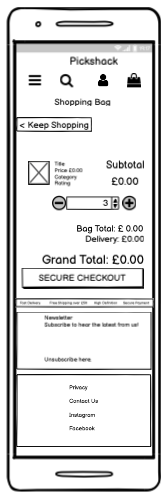
  

Checkout Page Mobile: 
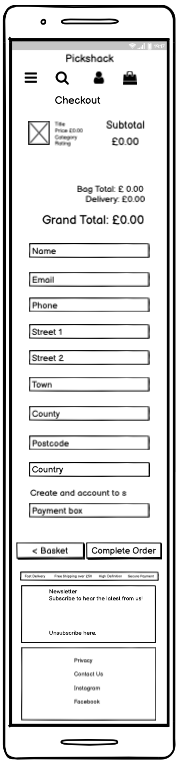
  

Order Confirmation Page Mobile: 
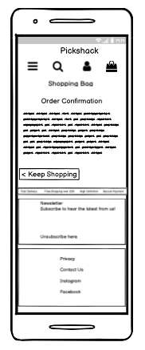
  

Contact Us Page Mobile: 
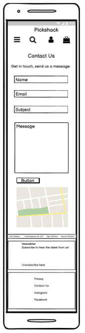
  

Landing Page Desktop: 
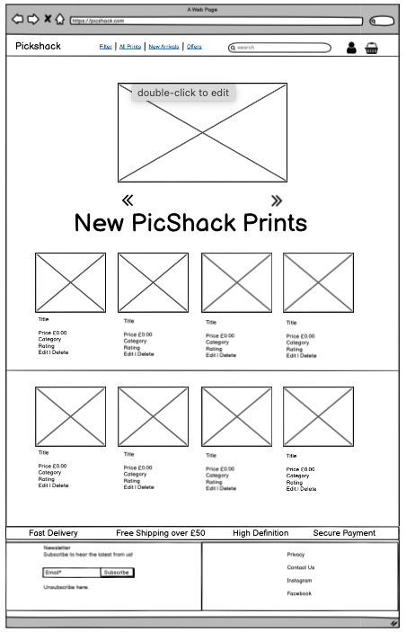
  

Sign In Page Desktop: 
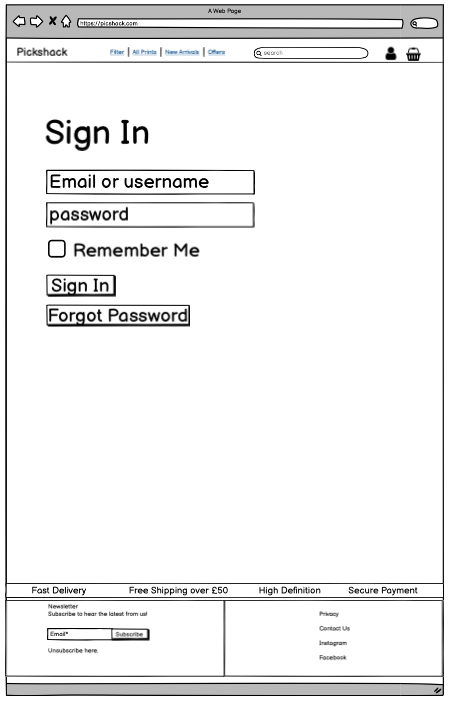
  

Signup  Page Desktop: 
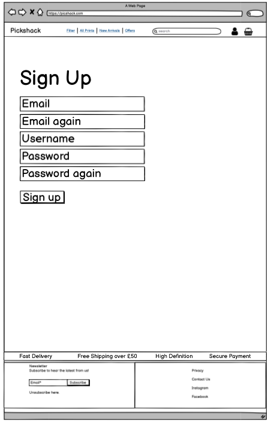
  

Products Page Desktop: 
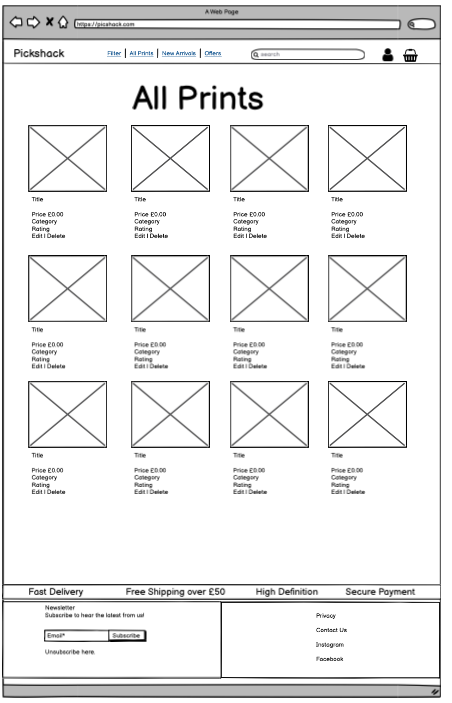
  

Product Detail Page Desktop: 
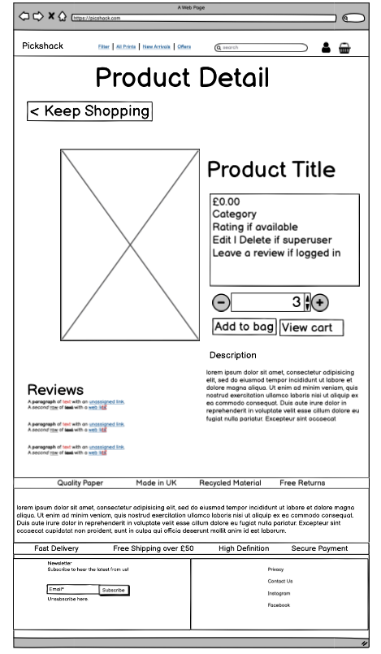
  

Shopping Bag Page Desktop: 
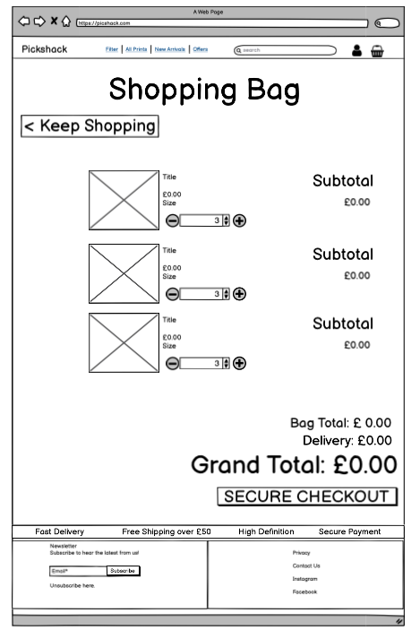
  

Checkout Page Desktop: 
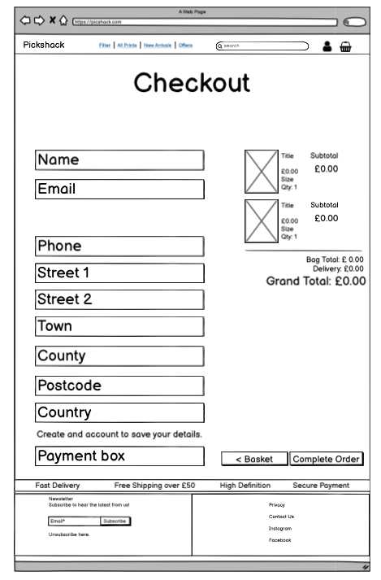
  

Order Confirmation Page Desktop: 
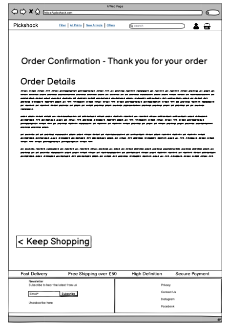
  

Contact Us Page Desktop: 
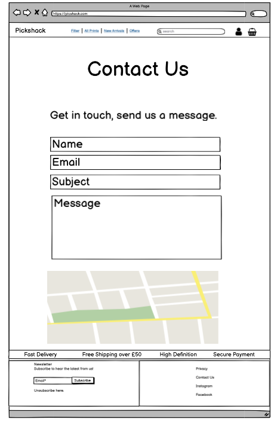

### [4. Testing](#manual-testing)
- HTML Validator
- CSS Validator
- JavaScript
- PEP8 Validator
- Manual Testing
### [5. Technologies Used](#tech-used)
### [6. Deployment](#deployment)
### [7. Bugs](#bugs)
- Known Fixed Bugs
- Existing Bugs
### [8. Credits](#credits)

  

[Top of the page](#top)
# <a name="user-ex">1. User Experience</a>

## Design Approach 

For the first time I wanted to develop an application that is out of my confort zone, just so I can experience what's it like to work on a type of project theme where I might not necessarily have a personal connection or passion in it especially topics related to art. I wanted to be able to adapt and experience what would it be like to work with the customer's various requests.

I have visitited a varity of art selling websites and made some notes on the layout and design of the page. I have noticed they were fitting nicely with Boutique Ado's framework and decided to merge the two together.

The goeal is to develop a site that is clear and easy to navigate without clutter or unecessary features.

  

## User Expectation

 

- ### A first time visitor:
	- Understand imediatly the purpose of the website.
	- Easily navigate and see a sample of the products on the landing page.
	- Identify any deals.
	- Search for products in the search bar.
	- Easily click on a product for details.
	- Select a size if applicable.
	- Filter by category or price.
	- Add a product to the basket.
	- Change quantity or remove product all together.
	- Add more products to qualify for free delivery.
	- See and overview of the items in the basket.
	- Securley checkout.
	- Successfully make a purchase.
	- Receive email confirmation of the purchase information.
	- Signup to the newsletter for latest deals.
  

- ### A returning user:
	- Create an account.
	- View the order history if applicable.
	- Leave review on products.
	- Delete review on products.
	- Update personal details.
	- Reset password.
	- Signup to the newsletter.

 

- ### A frequent user:
	- Visit the website's 'New PicShack Prints' for any new products.

 

[Top of the page](#top)

## Color Design
I have chosen to stick with a simple black and white design for accesssability purposes but also with the purpose of adding colours where it could make a difference to make a purchase.
  

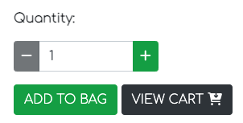

 

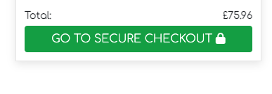

 

 

  

[Top of the page](#top)

# <a name="features">2. Features</a>
## Landing Page

### Main Image Banner

Insert Text

### Navigation Bar
Insert Text

Large Screen
Insert Text

### Category Cards
Insert Text

Insert Text

### Recent Posts
Insert Text

[Top of the page](#top)

## Footer
Insert Text

 

[Top of the page](#top)

## CRUD Functionality

A user can:

Insert Text
  

Insert Text
  

Insert Text
  

Insert Text
  

Insert Text
  

Insert Text
  

Insert Text
  

Insert Text
  

Insert Text

[Top of the page](#top)
## Authentication

Insert Text

Insert Text
  

Insert Text

Insert Text
  

## 404 Not Found

Insert Text

[Top of the page](#top)
## <a name="wireframe">3. Wireframe</a>
The wireframe was created using Balsamiq. As you can see, as the project evolved, the design has also changed, however the wireframe was crucial in identifying which design approach the website will take.

Insert Text

Insert Text

### Database Wireframe

Insert Text

Project cards have been used to keep track of progress and add new ideas, features and bugs. 
Insert Text
  

[Top of the page](#top)
## <a name="testing">4. Testing</a>

### HTML Validator
I a have used [validator.w3.ord](https://validator.w3.org/)to test all HTML documents. Because of using Django to build the application,
the same errors appeard on all html pages due to the Django sysntax. I have decided to ignore those and look any HTML syntax errors which there are none. 
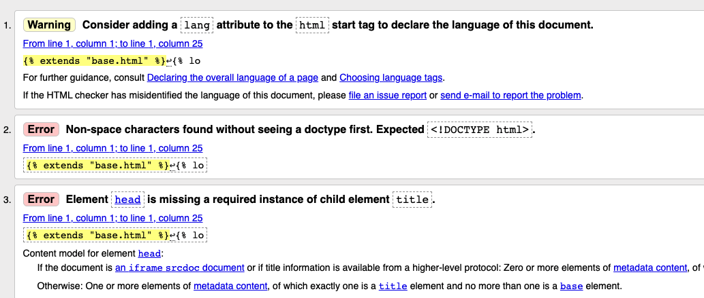
 

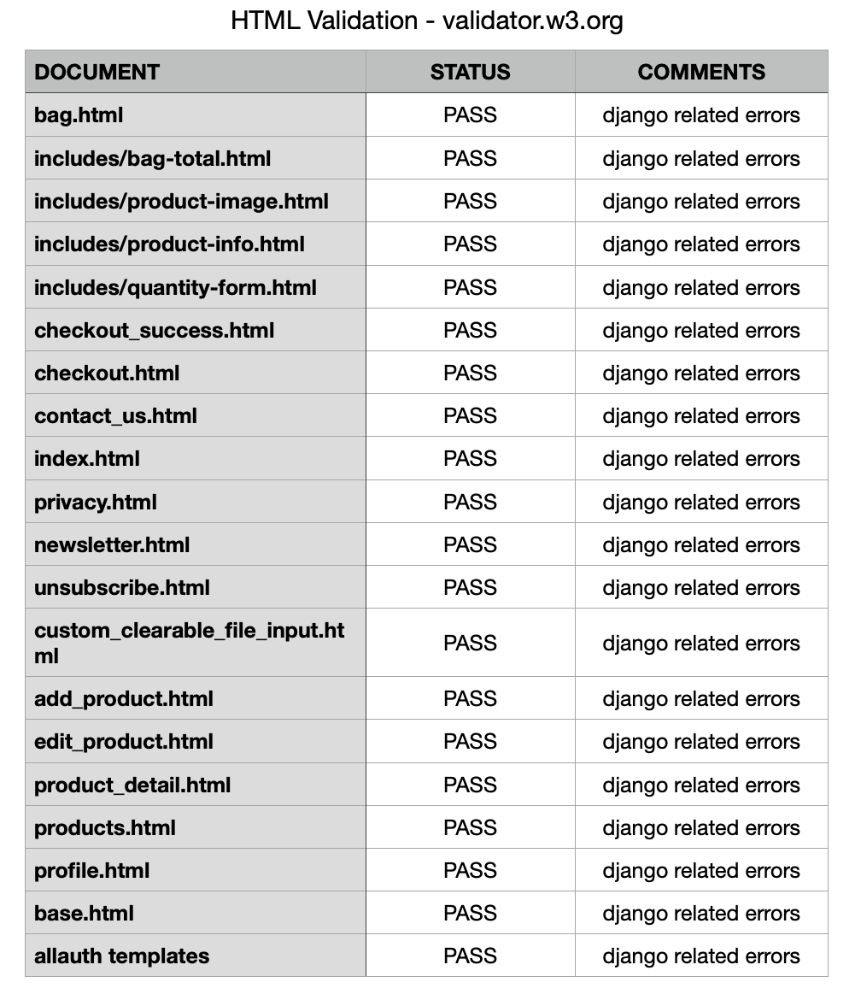

### CSS Validator

I have used [jigsaw.w3.org](https://jigsaw.w3.org/css-validator/) for the CSS testing. There are a few warnings related to colours and webkit extensions but no errors. 
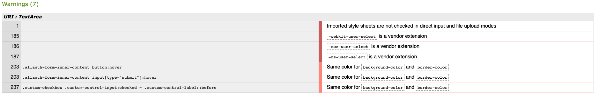
 

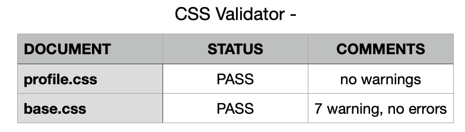
  

### Python Validator

I have used two methods to check for Python errors. I have quickly ran the command python3 -m pep8 which displayed any warnings or errors in all of the files.
And I have also used[pep8 online](http://pep8online.com/) to easilly identyfy the errors. 

The only document I haven't modified is the settings.py file. Due to the importance I have decided ignore this document. 
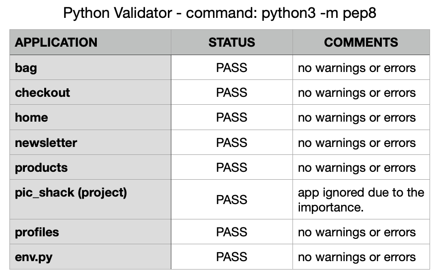
  

### JavaScript

I have used [jshint.com](https://jshint.com/) to validate my JavaScript code. There have been some warnings but no errors and since the code was written by Code Institute I have decided to ignore those. 

  

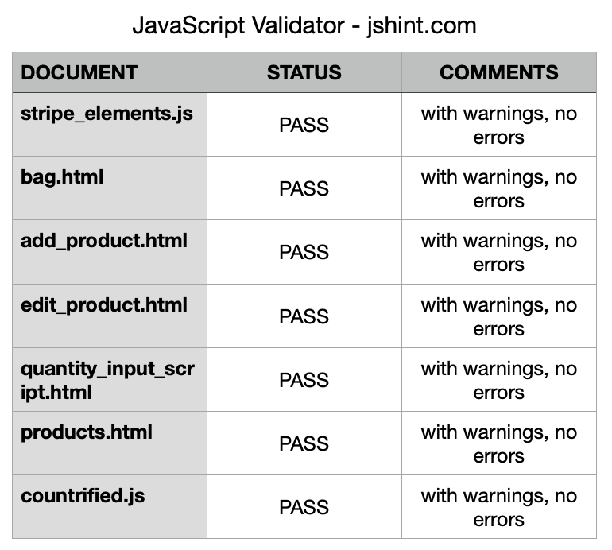

  

[Top of the page](#top)
### Manual Testing
I have been using [AmIResponsive](http://ami.responsivedesign.is) to check the responsivness of the website.

I have exrensivley tested all of the pages, links and functionality and recorded the outcome below.
 

Home Page: 
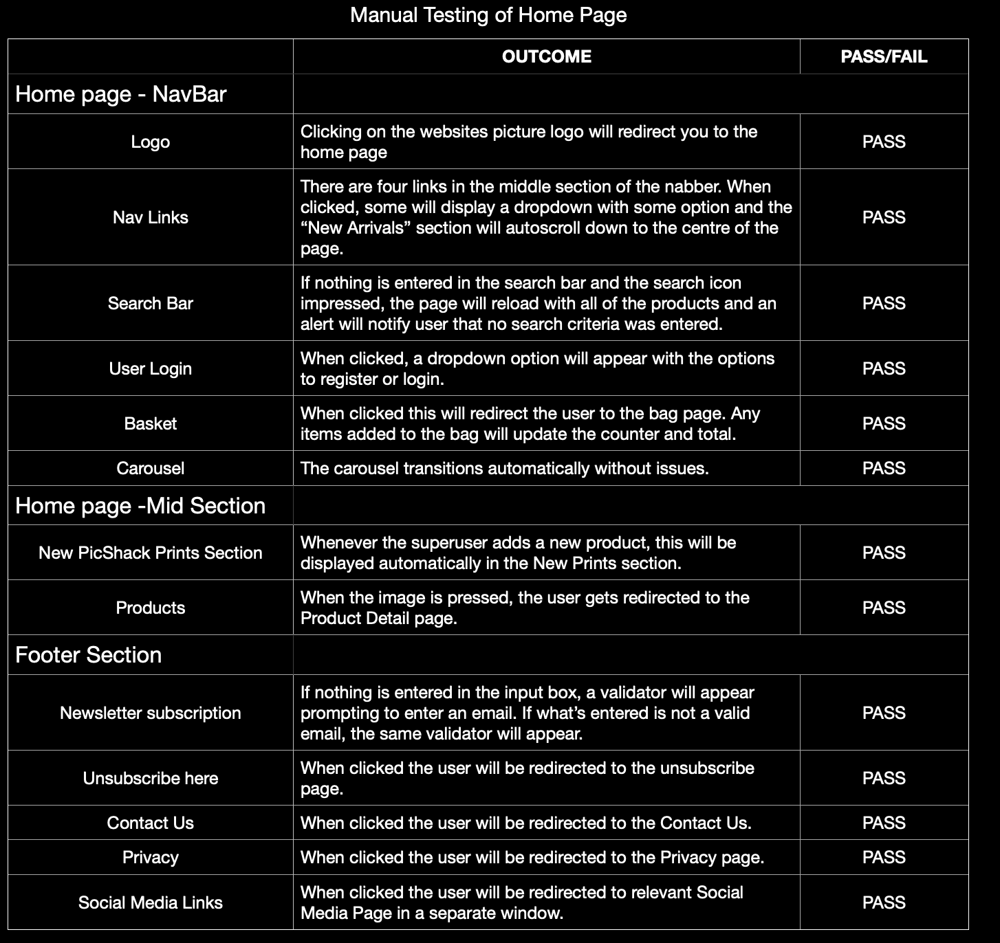 
  

Navigation Bar: 
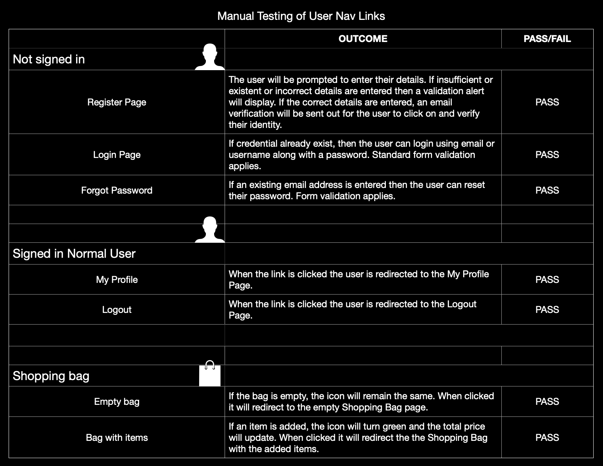
  

Product Page: 
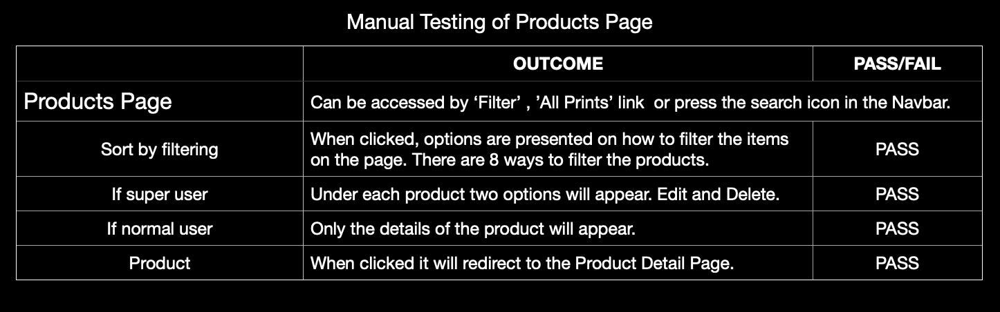
  

Product Detail Page: 
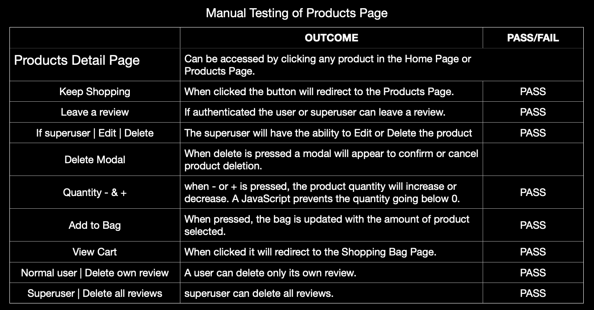
  

Superuser Product Management: 
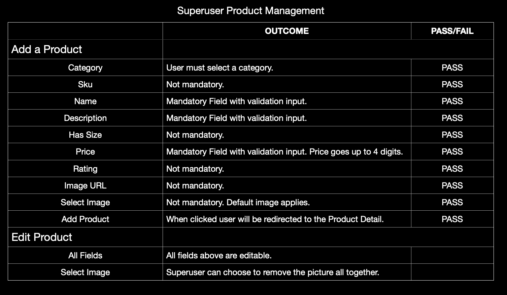
  

Checkout Process: 
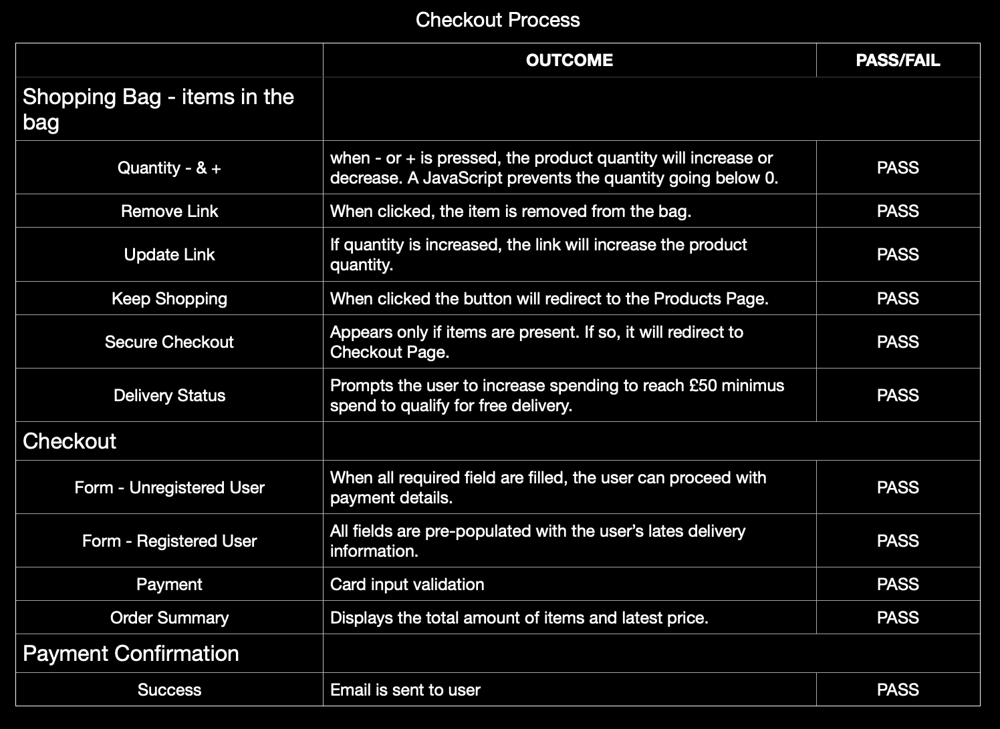
  

Contact Us Form: 
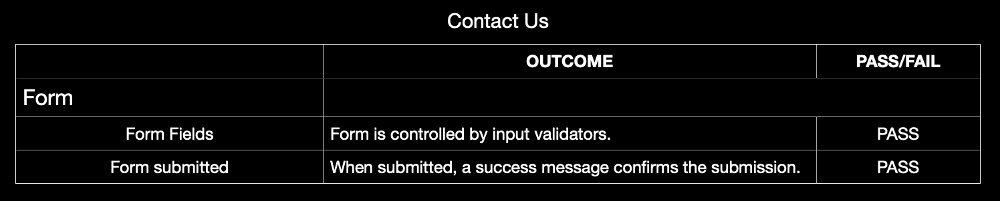
  

  

[Top of the page](#top)
## <a name="tech-used">5. Technologies used</a>

### HTML5
- For the Hyper Text Markup Language
### CSS3
- For the Cascade Style Sheets
### Python
- For the backend app development
### Javascript
- For the message allert timeout inspired by CI
### Boostrap 4
- For the styling of the website
### Django 3.8
- The base platform used to develop and bring all the dependencies together
### PostgreSQL
- For the Database
### Heroku
- For the app deployment
### Amazon AWS
- For the static and media files hosting
### Gitpod
- The code development platform
### Github
- To create and store my repository
### Balsamiq
- For the initial design of my wireframe
### FontAwesome
- For the icons present in templates
### Google Fonts
- For the fonts 
### Google Chrome
- For the Devtools
### Online Code Validators:
	- W3C
	- PEP8
	- JShint

  

[Top of the page](#top)

## <a name="deployment">6. Deployment</a>

### First Deployment

### Gitpod:
Insert Text

### Heroku
Insert Text

### Github
Insert Text

### Heroku
Insert Text

### Production Deployment

### Github & Gitpod 
Insert Text
### Heroku
Insert Text
  

[Top of the page](#top)

## <a name="bugs">7. Bugs</a>

### Known Fixed Bugs
Insert Text

  
### Existing Bugs
Insert Text

  

[Top of the page](#top)

## <a name="credits">8. Credits</a>

- [Stack Overflow](https://stackoverflow.com/) for help with code troubleshooting and suggestions on best practices.

- Code Institute for:
	- Gitpod initial template
	- Tutors of CI for helping me with some of the bugs
- My mentor Marcel Mulders for the constructive feedback and always pushing to go the extra step.