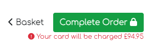
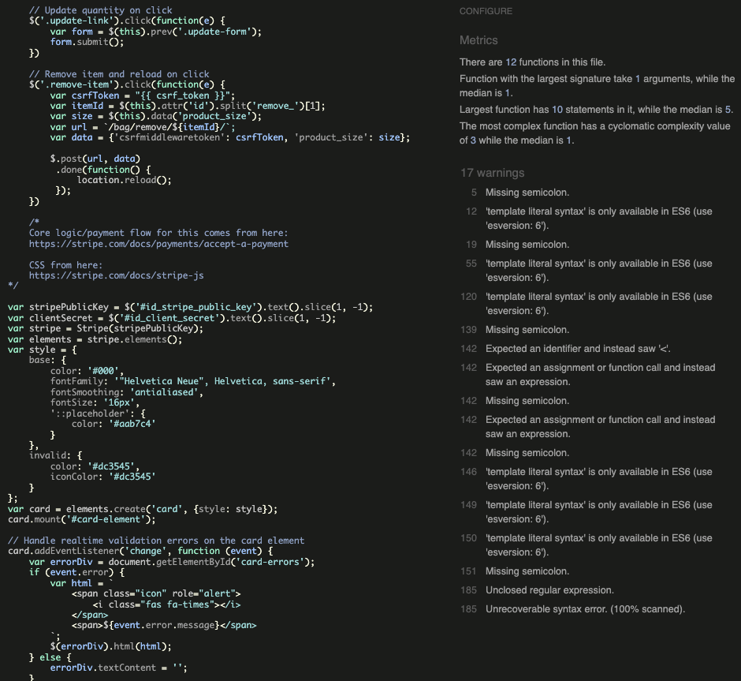
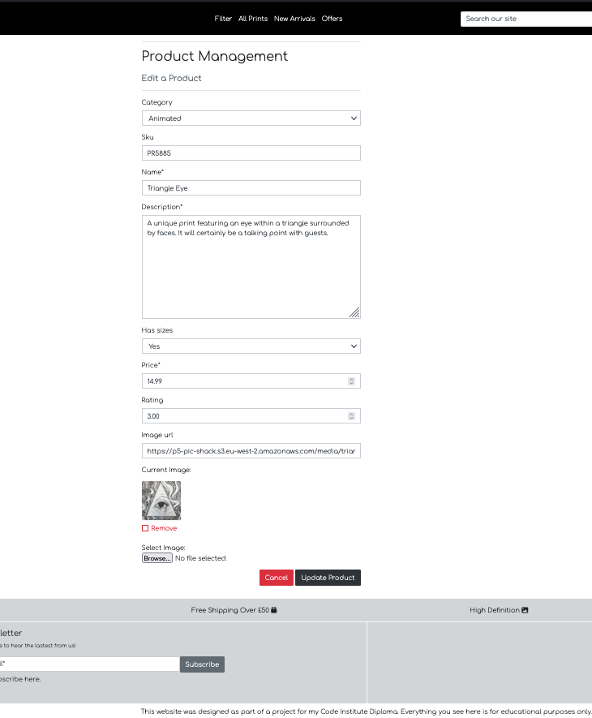
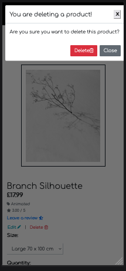
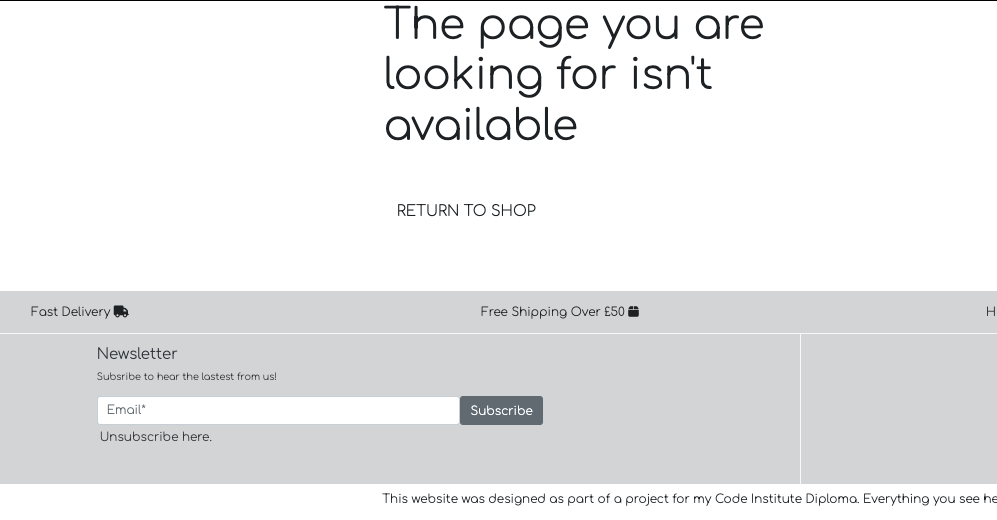
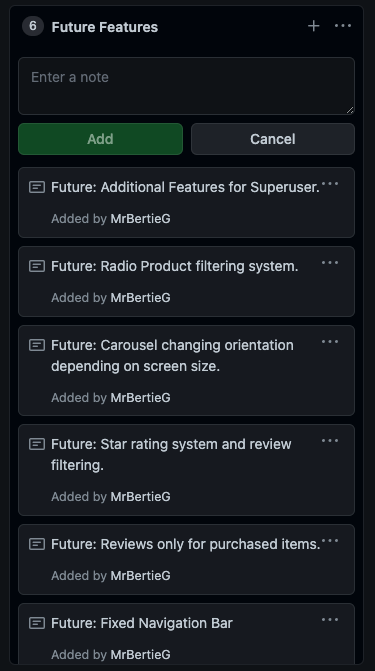
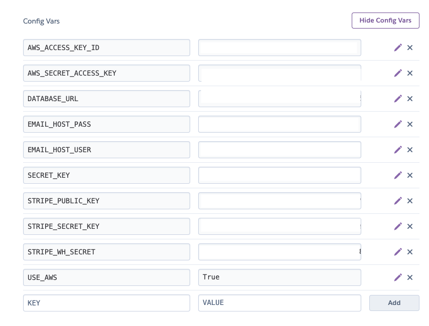

# PicShack.com

Live website [here](https://p5-pic-shack.herokuapp.com/).
 

# Introduction

Welcome to my final Code Institute Project 5. This a full e-commerce application website with the purpose of selling art such as prints. 

The website allows users to navigate freely, view products and make purchases without the need to create an account. The website incorporates full CRUD functionality. Another main feature of the website is the ability to have a superuser managing the content of the website and removing other users content if need be. This also incoporates full CRUD functionlity.

The prodject has been developed using Django 3.2 framework.

## <a name="top">Table of Contents</a>

### [1. User Experience](#user-ex) 

- Design Approach
- User Expectations
	- New Users
	- Returning Users
	- Frequent Users
- Color Design

### [2. Structure](#structure)
- Wireframe
- Database Structure
- Custom Models

### [3. Agile Method](#agile)
- Github Projects

### [4. Testing](#manual-testing)
- HTML Validator
- CSS Validator
- JavaScript
- PEP8 Validator
- Manual Testing
### [5. Technologies Used](#tech-used)

### [6. SEO](#seo)

### [7. Social Media & Marketing](#socialmedia)
- Business Model
- Social Media
- Marketing

### [8. Features & End Product](#features)
- Landing Page:
- Custom 404 Not Found Page
- Custom 500 Server Error

### [9. Potential Features](#future)

### [10. Deployment](#deployment)

### [11. Bugs](#bugs)
- Known Fixed Bugs
- Existing Bugs
### [12. Credits](#credits)

  

[Top of the page](#top)
# <a name="user-ex">1. User Experience</a>

## Design Approach 

For the first time I wanted to develop an application that is out of my confort zone, just so I can experience what's it like to work on a type of project theme where I might not necessarily have a personal connection or passion in it especially topics related to art. I wanted to be able to adapt and experience what would it be like to work with the customer's various requests.

I have visitited a varity of art selling websites and made some notes on the layout and design of the page. I have noticed they were fitting nicely with Boutique Ado's framework and decided to merge the two together.

The goal is to develop a site that is clear and easy to navigate without clutter or unecessary features.

  

## User Expectation
- ### A first time visitor:
	- Understand immediately the purpose of the website.
	- Easily navigate and see a sample of the products on the landing page.
	- Identify any deals.
	- Search for products in the search bar.
	- Easily click on a product for details.
	- Select a size if applicable.
	- Filter by category or price.
	- Add a product to the basket.
	- Change quantity or remove product all together.
	- Add more products to qualify for free delivery.
	- See and overview of the items in the basket.
	- Securley checkout.
	- Successfully make a purchase.
	- Receive email confirmation of the purchase information.
	- Signup to the newsletter for latest deals.
  

- ### A returning user:
	- Create an account.
	- View the order history if applicable.
	- Leave reviews on products.
	- Delete reviews on products.
	- Update personal details.
	- Reset password.
	- Signup to the newsletter.

 

- ### A frequent user:
	- Visit the website's 'New PicShack Prints' section for any new products.

 

[Top of the page](#top)

## Color Design
I have chosen to stick with a simple black and white design for accesssability purposes but also with the purpose of adding colours where it could make a difference to make a purchase.
  

 

 

 

  

[Top of the page](#top)

# <a name="structure">2. Structure</a>
The wireframe was created using Balsamiq. As you can see, as the project evolved, the design has also changed, however the wireframe was crucial in identifying which design approach the website will take.

The purpose of the wireframe is to try and visualise what the application will look like in desktop and mobile format. This is for guidance only.

Landing Page Mobile: 

  

Sign In Page Mobile: 

  

Signup Page Mobile: 

  

Products Page Mobile: 

  

Product Detail Page Mobile: 

  

Shopping Bag Page Mobile: 

  

Checkout Page Mobile: 

  

Order Confirmation Page Mobile: 

  

Contact Us Page Mobile: 

  

Landing Page Desktop: 

  

Sign In Page Desktop: 

  

Signup  Page Desktop: 

  

Products Page Desktop: 

  

Product Detail Page Desktop: 

  

Shopping Bag Page Desktop: 

  

Checkout Page Desktop: 

  

Order Confirmation Page Desktop: 

  

Contact Us Page Desktop: 

### Database Structure

  

### Custom Models
A custom Review model has been added to the Product App. This is for the handling of the user and admin reviews. 

 
 

A custom Newsletter Application has been added to handle new subscrptions. 

 
 

A custome Contact us model has been created to handle the users enquiries. 

 
 

[Top of the page](#top)
## <a name="agile">3. Agile Method</a>

Project cards or Issue cards have been used to keep track of progress and add new ideas, features and bugs to fix. Link to the project [here](https://github.com/MrBertieG/pic-shack-p5/projects/1) 

  

[Top of the page](#top)
## <a name="testing">4. Testing</a>

### HTML Validator
I a have used [validator.w3.ord](https://validator.w3.org/) to test all HTML documents. Because of using Django to build the application,
the same errors appeard on all html pages due to the Django syntax. I have decided to ignore those and look for any HTML syntax errors which there are none. 

 

### CSS Validator

I have used [jigsaw.w3.org](https://jigsaw.w3.org/css-validator/) for the CSS testing. There are a few warnings related to colours and webkit extensions but no errors. 

 

  

### Python Validator

I have used two methods to check for Python errors. I have quickly ran the command python3 -m pep8 which displayed any warnings or errors in all of the files.
And I have also used [pep8 online](http://pep8online.com/) to easilly identyfy the errors. 

The only document I haven't modified is the settings.py file. Due to the importance of this file I have decided ignore this document. 

  

### JavaScript

I have used [jshint.com](https://jshint.com/) to validate my JavaScript code. There have been some warnings but no errors and since the code was written by Code Institute I have decided to ignore those. 

  

  

[Top of the page](#top)
### Manual Testing
I have been using [AmIResponsive](http://ami.responsivedesign.is) to check the responsivness of the website.

I have extensively tested all of the pages, links and functionality and recorded the outcome below.
 

Home Page: 
 
  

Navigation Bar: 

  

Product Page: 

  

Product Detail Page: 

  

Superuser Product Management: 

  

Checkout Process: 

  

Contact Us Form: 

  

  

[Top of the page](#top)
## <a name="tech-used">5. Technologies used</a>

### HTML5
- For the Hyper Text Markup Language
### CSS3
- For the Cascade Style Sheets
### Python
- For the backend app development
### Javascript
- For the message allerts
### Boostrap 4
- For the styling of the website
### Django 3.2
- The base platform used to develop and bring all the dependencies together
### PostgreSQL
- For the Database
### Heroku
- For the app deployment
### Amazon AWS
- For the static and media files hosting
### Gitpod
- The code development platform
### Github
- To create and store my repository
### Balsamiq
- For the initial design of my wireframe
### FontAwesome
- For the icons present in templates
### Google Fonts
- For the fonts 
### Google Chrome
- For the Devtools
### Online Code Validators:
	- W3C
	- PEP8
	- JShint

  

[Top of the page](#top)

## <a name="seo">7. Search Engine Optimasation</a>

For the SEO optimaiztion I have used words such as art, prints,  newest prints, design trends, abstract design, real shots, animated, new prints arrivals.

The website has also a sitemap generated with an [XML generator](https://www.xml-sitemaps.com/).
I have also created a policy page using [PolicyMaker](https://policymaker.io/).

I have included this meta description in my base template.  

[Top of the page](#top)

## <a name="socialmedia">8. Social Media & Marketing</a>

### Business Model

The business model for PicShack.com is a B2C or Business-to-Consumer model, meaning that the website as the business is selling products directly to consumers who are the end-users. 

The main goal is for the consumers to buy the prints in the most efficient and quickest way at prices in line with market competitors.

### Social Media

I have created a Facebook page for PicShack. 

  

  

### Marketing

For the marketing strategy I have chosen to create my own Newsletter Application. Throught the subscription model I will be collecting users emails and roll out marketing emails. The model will also allow the users to easilly unsubscibe should they wish to.

I will also be making full use of the Facebook Page and continuously run campaigns to promote sales.

[Top of the page](#top)
## <a name="features">7. Features & End Product</a>

### Landing Page

Desktop Carousel: 

  

Desktop NavBar: 

  

Mobile NavBar: 

  

Desktop New Arrivals: 

  

Mobile New Arrivals: 

  

Desktop Footer: 

  

Mobile Footer: 

  

Desktop All Products: 

  

Mobile Desktop All Products: 

  

Desktop Product Detail: 

  

Mobile Product Detail: 

  

Desktop Toast Success: 

  

Mobile Toast Success: 

  

Desktop Shopping Bag: 

  

Mobile Shopping Bag: 

  

Desktop Checkout: 

  

Mobile Checkout: 

  

Desktop Confirmation Order: 

  

Mobile Confirmation Email: 

  

Confirmation Order Email: 

  

Desktop Product Management: 

  

Mobile Product Management: 

  

Desktop Edit Product Management: 

  

Desktop Delete Product: 

  

Mobile Delete Product: 

  

Desktop Add Review: 

  

Mobile Add Review: 

  

Error 404 and Server 500 error custom page: 

  

[Top of the page](#top)
## <a name="future">7. Potential Features</a>

Due to time constraints I haven't been able to impelement some of the changes I had planned. 

  

[Top of the page](#top)
## <a name="deployment">8. Deployment</a>

### First Deployment

### Gitpod:
- Create a new repository using the Code Institute template
- Follow the guide provided by CI to install Django and it's dependencies
- Create the new project 'pic-shack-p5'
- install dj_database_url and psycopg2-binary
- Link to Heroku via the Procfile
- Create requirements file

### Heroku
- Log into Heroku and create a new app 'p5-pic-shack'
- in the 'Resources' tab search for PostgreSQL and sellect the 'hobby' option.
- In the 'Settings' tab enable Config Vars
- Link the following:
	- DATABASE_URL
	- SECRET_KEY
	- DISABLE_COLLECTSTATIC set to 1

### Stripe
- Setup an account
- In the Developers tab find API Keys
- Copy STRIPE_PUBLIC_KEY and STRIPE_SECRET_KEY
- In the webhooks tab add endpoint URL from the website (don't forget the / at the end) 
- Reveal WH Secret and add to Heroku

### Gmail
- Setup new account
- Settings > All Settings > Accounts - import
- Other Google Accounts Settings
- Security > enable Two Step Verification
- Security >App Passwords: 
	- Select Mail
	Select Device > Other > Type Django > Copy password
- Add in Heroku config vars:
	- EMAIL_HOST_PASS : paste password
	- EMAIL_HOST_USER : new created email

## AWS Hosting
- Setup new account
- Find AWS Management Console
- Click All Services > Storage > S3 Bucket
- Create New Bucket
- Add bucket name
- Navigate to Object Ownership > enable ACL > Bucket Owner - preffered
- Set Block Public Access to public. Acknowledge warnings and continue.
- Create Bucket
- In the new Bucket window select Properties > Static web hosting > Edit > Enable > fill input boxes with suggested.
- Permissions Tab > CORS textarea paste: 

	[
  {
      "AllowedHeaders": [
          "Authorization"
      ],
      "AllowedMethods": [
          "GET"
      ],
      "AllowedOrigins": [
          "*"
      ],
      "ExposeHeaders": []
  }
]

- Bucket Policy > Edit Bucket Policy > AWS Policy Generator
- Type of Policy : S3 Bucket Policy Principal*
- Go to ARN copy and paste key into Bucket Policy Page > Permissions > Add Statement > Generate Policy > Copy the policy >
Paste into Bucket Policy Editor: 
	- Edit "Resources" and add the name of the bucket + '/' > Save.
	- Navigate to ACL > Edit - check Everyone > Save
	- Navigate to IAM
	- User Groups > Create Group - name: "manage-pic-shack-p5" > Create
	- Naigate to Policies > Create Policy > Import Managed Policy - AmazonS3FullAccess > Copy ARN
	- Paste ARN into : "Resource": "arn key , arn key + /* " > Add Tags > Next > Review > Create Policy

	- User Group > Select the new group > Permissions > Attach Policies > Find the policy > Add Permissions
	- Creating the users: 
		- manage-pic-shack-p5 > Access Key > Programmatic Access > Next
		- Add user to the group > Next Tags > Next:review > Create USer
		- IMPORTANT: Download file and keep safe.

### Gitpod Terminal
- install boto3
- install django-storages
- update settings.py apps
- settings.py:

STATIC_URL = '/static/'
STATICFILES_DIRS = (os.path.join(BASE_DIR, 'static'),)

MEDIA_URL = '/media/'
MEDIA_ROOT = os.path.join(BASE_DIR, 'media')

if 'USE_AWS' in os.environ:
    # Cache Control
    AWS_S3_OBJECT_PARAMETERS = {
        'Expires': 'Thu, 31 Dec 2099 20:00:00 GMT',
        'CacheControl': 'max-age=94608000',
    }

    # Bucket Config
    AWS_STORAGE_BUCKET_NAME = 'p5-pic-shack'
    AWS_S3_REGION_NAME = 'eu-west-2'
    AWS_ACCESS_KEY_ID = os.environ.get('AWS_ACCESS_KEY_ID')
    AWS_SECRET_ACCESS_KEY = os.environ.get('AWS_SECRET_ACCESS_KEY')
    AWS_S3_CUSTOM_DOMAIN = f'{AWS_STORAGE_BUCKET_NAME}.s3.amazonaws.com'

    # Static and media files
    STATICFILES_STORAGE = 'custom_storages.StaticStorage'
    STATICFILES_LOCATION = 'static'
    DEFAULT_FILE_STORAGE = 'custom_storages.MediaStorage'
    MEDIAFILES_LOCATION = 'media'

    # Override static and media URLs in production
    STATIC_URL = f'https://{AWS_S3_CUSTOM_DOMAIN}/{STATICFILES_LOCATION}/'
    MEDIA_URL = f'https://{AWS_S3_CUSTOM_DOMAIN}/{MEDIAFILES_LOCATION}/'

### Heroku Config Vars

Add Keys to config VArs  

### Gitpod

Create file in root custom_storages.py 

from django.conf import settings
from storages.backends.s3boto3 import S3Boto3Storage

class StaticStorage(S3Boto3Storage):
    location = settings.STATICFILES_LOCATION

class MediaStorage(S3Boto3Storage):
    location = settings.MEDIAFILES_LOCATION

Now media is located in AWS S3 folder.
  

Your requirements.txt file should look like this: 

asgiref==3.5.0
boto3==1.22.9
botocore==1.25.9
dj-database-url==0.5.0
Django==3.2
django-allauth==0.41.0
django-countries==7.2.1
django-crispy-forms==1.14.0
django-libs==2.0.3
django-storages==1.12.3
gunicorn==20.1.0
jmespath==1.0.0
oauthlib==3.2.0
Pillow==9.1.0
psycopg2-binary==2.9.3
python3-openid==3.2.0
pytz==2022.1
requests-oauthlib==1.3.1
s3transfer==0.5.2
sqlparse==0.4.2
stripe==2.75.0

[Top of the page](#top)

## <a name="bugs">7. Bugs</a>

### Known Fixed Bugs
Problem: 
When deleting products from the Products page, other products were getting deleted rather than the selected product.
  
Solution: 
Due to time constraints I have deleted this feature and kept the Delete functionality from the Product Detail Page.
  
Problem:<be>
Email confirmations were not going out.
  
Solution: 
Webhook endpoint in Stripe was missing '/'.
  
Problem: 
Error 500 when purchase was made. This was because the field in the Order model named size was only 2 characters long. I have changed it to 10 and made migrations.
  
Other bugs included: 

- Reviews were displaying on all products.
- Carousel was scalling in and out when transitioning.
- New arrivals was not displaying the latest uploaded products.
- Superuser couldn't delete users reviews.

  

### Existing Bugs
The CSS files someitmes doesn't load on the first attempt. The browsers needs to be hard refreshed and the CSS document will kick in. 

  

[Top of the page](#top)

## <a name="credits">8. Credits</a>

- [Stack Overflow](https://stackoverflow.com/) for help with code troubleshooting and suggestions on best practices.

- Code Institute for:
	- Gitpod initial template
	- Tutors of CI for helping me with some of the bugs
- My mentor Marcel Mulders for the constructive feedback and always pushing to go the extra step.